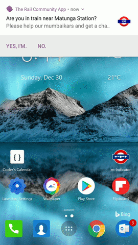
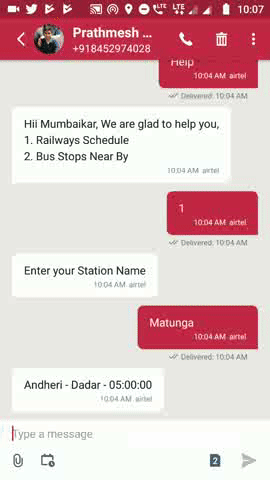

# The Rail Community App - mIndicator Hackathon
The Rail Community App developed during the 24hr event of VJTI Technovanza's mIndicator hackathon 2018 serving the hackathons motto of "People will help people". Its is an extended version of the existing mIndicator App providing more features such as Live Tracking and Rush Status of the trains using crowd sourcing, Rail Chat Translate, Last mile connectivity for users, Offline services using SMS chatbot, Discussion forums for the Rail Community providing a social network like experience with profile page for each user.

## Getting Started
The Project is developed using Native Android and the backend is in PHP with MySQL Database.
So the Project Repository contains two folder one of Android app and other of Backend API and DB.
* Once the project is cloned you need to import the Database from the DB folder into PHPmyadmin of your local machine.
* Place the folder inside of Web API in the htdocs folder of your PHP localhost.
* Put the HereMaps direction api APP_ID in transit.php and transitsms.php
* Put the Yandex Translate API KEY in translate.php
* Run the Android/Team TwinPrime Folder in Android Studio 2.0 or greater.
* Provide all the Twitter API Credentials in TwitterFragment.java
* Open the string.xml file of value folder in Android Studio and change the IP Address String to the IP Address of your Local Machine.

### Prerequisites

* [Android Studio 2.0 or above](https://developer.android.com/studio/index.html)
* [XAMPP PHP 5.6 or above](https://www.apachefriends.org/download.html)
* Android Phone | Requirement : Lolipop 5.0 or above, Camera.

## Demo
### The features implemented along with their feature
Screenshot or Video | Feature Details|
:-------------------------:|:-------------------------:|
  | <b>Live Location & Rush Status</b> -  providing live location and rush status of all trains using crowd sourcing |
  | <b>Last Mile Connectivity</b> - providing last mile connectivity to users by giving direction to nearby bustops as well providing the list of bus nos. for that specific bus stop  |
  | <b>Translate feature on Rail Chat</b> - implementation of translate feature on a dummy RailChat like Activity  |
  | <b>SMS Chatbot as a Offline Service - </b> Providing selected functionalities in Offline mode using SMS chat bot incase of no data connection  |
<table><tr><td></td> <td> </td></tr></table>  | <b>Shelter Service during disaster - </b> Providing list of nearby shelters during disaster as well as providing your home as shelter |
<table><tr><td></td> <td> </td></tr></table>  | <b>Discussion Forum for Rail Community - </b> Allowing users to particiapte in discussion forums as well creating new forums of their own |
<table><tr><td></td> <td> </td></tr></table>  | <b>Social Network like UX - </b> Providing profile page and search option thus giving a social media like experience |
  | <b> mIndicatorRail Twitter Feed- </b> Providing all the tweets with #mIndicatorRail hashtag as well as allowing users to tweet with the same hashtag  |
  | <b>User of the month - </b> Page dedicated for all the users who contributed the most in the current month in crowd sourcing activities  |

## Built With

* [Yandex translate API](https://translate.yandex.com/) -  API for Translation
* [Here Maps API](https://developer.here.com/) - Direction API.
* [TextIT Flow API](https://help.nyaruka.com/) - SMS Flow Service.
* [Twitter API](https://developer.twitter.com/en/docs.html)

## Awards and Honours
* 1st Runner up at VJTI Technovanza mIndicator hackathon 2018

## Authors
* **Prathamesh Mhapsekar** - *Initial work* - [prathmesh36](https://github.com/prathmesh36)
* **Mandar Mhapsekar** - *Initial work* - [mandar100](https://github.com/mandar100)

## License

This project is licensed under the MIT License - see the [LICENSE.md](LICENSE.md) file for details